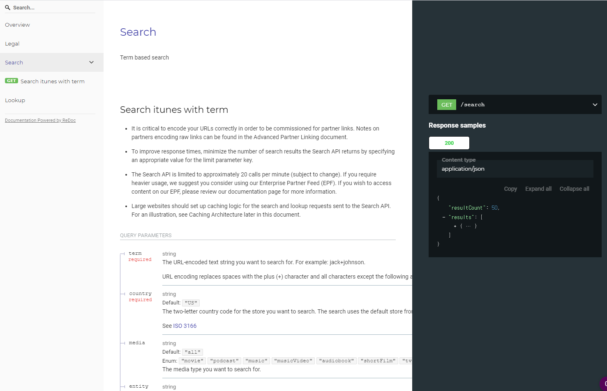

# Swagger - Itunes Search API

[Openapi 3.0 spec](https://swagger.io/specification) of itunes search api 

### Deploying / Publishing
Refer to [redoc](https://kokospapa8.github.io/swagger-itunes-search-api/) for swagger.

## Versioning
- 1.0.0 initial setup

## Api Reference
[iTunes Affiliate program doc](https://affiliate.itunes.apple.com/resources/documentation/itunes-store-web-service-search-api/)

## Licensing
MIT license 
